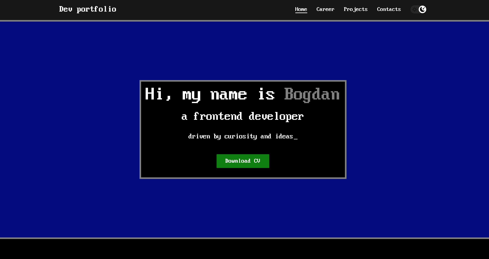

# Dev website portfolio — Bogdan Makarchuk

## Описание проекта
Это персональное портфолио, разработанное с использованием **Next.js**, **React**, **TypeScript**. Цель проекта — предоставить структурированную и технически грамотную презентацию моих навыков, опыта и проектов, выполненных в сфере frontend-разработки.

Проект опубликован и доступен по адресу:
🔗 [Открыть проект в браузере](https://makarchuk-tech.vercel.app)

Предыдущая версия проекта:
🔗 [Открыть репозиторий](https://github.com/RainbowEclipsee/my-dev-cv-portfolio)

## Возможности

- Главная страница с кратким представлением навыков
- Возможность скачать CV в формате PDF (отдельный проект 🔗 [доступный по адрессу](https://cv.makarchuk-tech.vercel.app/))
- Страница **Career** с подробным описанием профессионального опыта
- Страница **Projects** со списком реализованных проектов
- Поддержка **тёмной темы** (сохранение предпочтения в `localStorage`)
- Динамическая маршрутизация
- Интеграция с **Vercel Speed Insights** для сбора аналитики и анализа производительности

## Используемый стек

- **Next.js 15**
- **React 19**
- **TypeScript 5**
- **Vercel**
- **ESLint**

## Запуск проекта 

1. Установка зависимостей:
  npm install 
  
2. Запустите сервер разработки:
  npm run dev

3. Перейдите в браузере:
  http://localhost:3000
